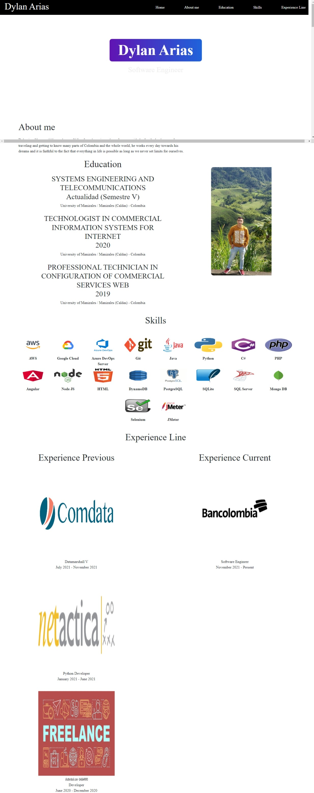

# Curriculum Dylan Arias
## Contenido
> Todo el proyecto esta construido en la rama **main** en la cual se encontraran los siguientes archivos
* **main.html:** Dentro del *main.hmtl* se encuentra toda la construccion visual de nuestro curriculo.
* **assets** Dentro de la carpeta *assets/css* se encuentran todos los estilos que ayudan a la perseccion visual de la pagina.
* **sources:** Dentro de la carpeta *sources* se encuentran todos los recursos como imagenes o gif que posee la pagina.

## Nuestra pagina
> Si quieres ver el demo de nuestra pagina, puedes visitar 
[Curriculo Dylan Arias](https://darias05.github.io/curriculum_viate/)

## Como clonar
> Para clonar el proyecto brindamos las siguientes 3 opciones.
 * **HTTPS:** https://github.com/darias05/Curriculum_Viate.git
 * **SSH:** git@github.com:darias05/Curriculum_Viate.git
 * **GitHub CLI:** gh repo clone darias05/Curriculum_Viate

 ## Avance
> Esta imagen nos permite previsualizar una vista previa de la imagen
